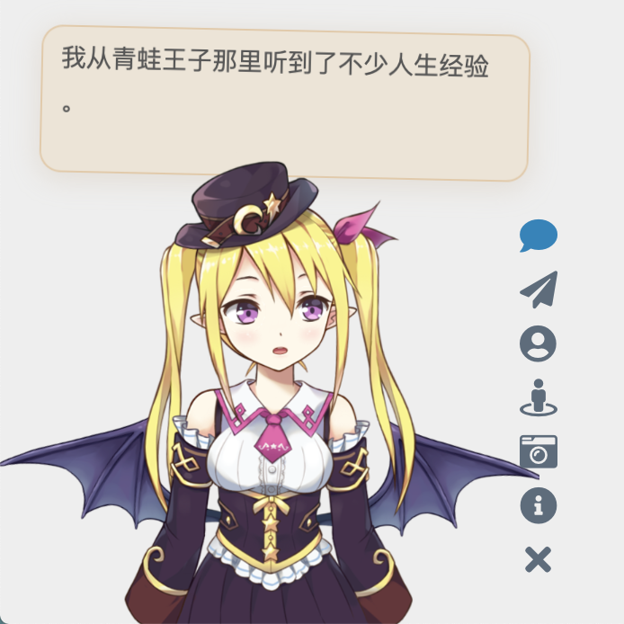

# Live2D Widget

一个轻量级的网页 Live2D 看板娘组件，基于 Cubism 5 SDK，支持本地模型加载。

> 本仓库不包含模型文件，需自行准备 Cubism 5 模型。

## 特性

- 本地模型加载，无需后端 API
- Cubism 5 SDK 支持
- 内联 Shader，无需额外网络请求
- 一言 API 多源支持（hitokoto.cn、jinrishici.com）
- 来路检测，识别百度、360、搜狗、谷歌等搜索引擎
- 自动压缩贴图，首次加载快速
- Service Worker 缓存，二次加载秒开

## 快速开始

### 1. 克隆项目

```bash
git clone https://github.com/Nh12356-git/live2d-widget.git
cd live2d-widget
```

或直接下载 ZIP 包解压。

### 2. 安装依赖并构建

```bash
npm install
npm run build
```

### 3. 添加模型

将 Cubism 5 模型放到 `model/` 目录下：

```
model/
  your-model/
    your-model.model3.json
    your-model.moc3
    texture_00.png
    texture_01.png
```

### 4. 配置模型

编辑 `dist/waifu-tips.json`，修改 `models` 数组：

```json
{
  "models": [{
    "name": "your-model",
    "paths": ["../model/your-model/your-model.model3.json"],
    "message": "模型加载完成！"
  }]
}
```

### 5. 启动本地服务器

```bash
npx http-server -p 8080
```

访问 `http://localhost:8080/demo/demo.html`

## 预览





## 项目结构

| 目录 | 说明 |
|------|------|
| `src/` | TypeScript 源代码 |
| `src/cubism5/` | Cubism 5 集成代码 |
| `demo/` | 演示页面 |
| `scripts/` | 构建脚本 |
| `model/` | 模型文件（需自行添加） |

## 配置说明

### autoload.js

编辑 `dist/autoload.js`：

```javascript
initWidget({
  waifuPath: 'path/to/waifu-tips.json',
  cubism5Path: 'path/to/live2dcubismcore.min.js',
  tools: ['hitokoto', 'switch-model', 'switch-texture', 'photo', 'info', 'quit'],
  hitokotoApi: 'hitokoto',  // 可选: 'hitokoto' 或 'jinrishici'
  logLevel: 'warn',
  drag: false,
});
```

### waifu-tips.json

编辑 `dist/waifu-tips.json` 配置模型和提示消息：

```json
{
  "models": [{
    "name": "your-model",
    "paths": ["path/to/your-model.model3.json"],
    "message": "模型加载完成！"
  }],
  "message": {
    "welcome": "欢迎阅读「$1」",
    "hitokoto": "这句一言来自「$1」"
  }
}
```

### 贴图压缩（可选）

使用内置脚本压缩贴图：

```bash
node scripts/compress-textures.mjs
```

将 8192px 贴图压缩到 4096px，减少约 80% 文件大小。

## 许可证

本项目基于 GNU General Public License v3 协议开源。

Live2D 相关代码的使用请遵守对应的许可：
- Live2D Cubism SDK 5: [Live2D Proprietary Software License](https://www.live2d.com/eula/live2d-proprietary-software-license-agreement_cn.html)
- Live2D Cubism Components: [Live2D Open Software License](https://www.live2d.com/eula/live2d-open-software-license-agreement_cn.html)

## 致谢

- [Live2D](https://www.live2d.com/) - Cubism SDK
- [stevenjoezhang/live2d-widget](https://github.com/stevenjoezhang/live2d-widget) - 原始项目
- [FGHRSH](https://www.fghrsh.net/post/123.html) - 看板娘教程
- [一言](https://hitokoto.cn) - 一言 API
